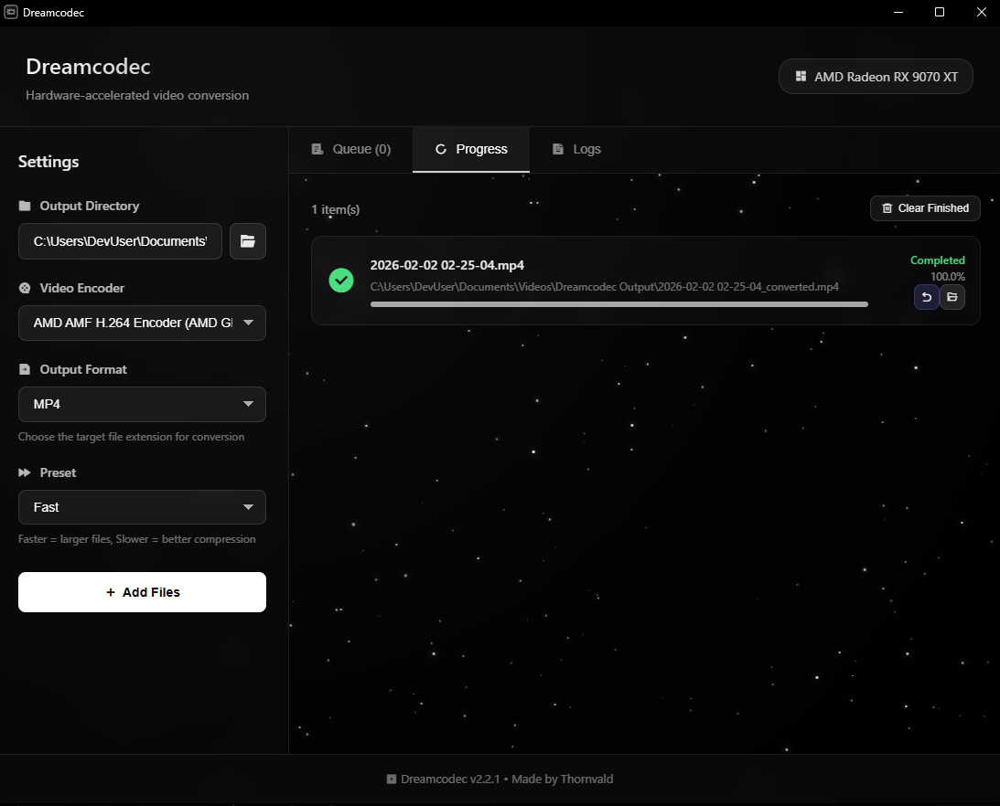

# Dreamcodec

A modern desktop application for converting video and audio files with GPU hardware acceleration and Adobe/After Effects compatibility. Built with Tauri 2, React + TypeScript, and Rust.




## Features

- **All-in-One Converter**: Convert between any video/audio formats - MP4, MKV, AVI, MOV, WMV, FLV, WEBM, MP3, WAV, AAC, FLAC, M4A, and more
- **GPU Hardware Acceleration**: Automatically detects NVIDIA/AMD/Intel adapters (including integrated GPUs), with adapter selection for hardware encoding
- **Native Drag & Drop**: OS-level drag/drop support with full-screen "Drop files here" overlay feedback
- **Adobe/After Effects Compatible**: Export to ProRes, DNxHD, DNxHR, and CineForm formats for professional workflows
- **Auto FFmpeg Detection**: Automatically finds FFmpeg from bundled, PATH, common locations, or WinGet installations
- **Batch Conversion**: Add multiple files to a queue for sequential conversion
- **Modern UI**: Clean, grayscale-themed interface with parallax star background and real-time progress tracking

## Supported Formats

### Input Formats
MKV, MP4, AVI, MOV, WMV, FLV, WEBM, OGV, and most video formats

### Output Formats

| Category | Formats |
|----------|---------|
| **Video** | MP4, MKV, AVI, MOV |
| **Audio Only** | MP3, WAV, AAC, FLAC, M4A, OGG |
| **Professional (Adobe/AE)** | ProRes 422, ProRes 422 HQ, ProRes 4444, DNxHD, DNxHR, CineForm |

### GPU Encoders

| GPU | H.264 | H.265/HEVC |
|-----|-------|------------|
| NVIDIA GeForce GTX 600+ | Yes NVENC | Yes NVENC |
| AMD Radeon HD 7000+ | Yes AMF | Yes AMF |
| Intel 4th Gen Core+ | Yes Quick Sync | Yes Quick Sync |
| Any CPU | Yes libx264 | Yes libx265 |

## Installation

### Option 1: Download Pre-built Installer (Recommended)

1. Go to the [Releases](https://github.com/Thornvald/Dreamcodec/releases) page
2. Download the latest `Dreamcodec_*_x64-setup.exe`
3. Run the installer and follow the instructions
4. FFmpeg is automatically detected or bundled with the app

### Option 2: Build from Source

#### Prerequisites
- [Node.js](https://nodejs.org/) (v18 or later)
- [Rust](https://rustup.rs/) (latest stable)

#### Build Steps

```bash
# Clone the repository
git clone https://github.com/Thornvald/Dreamcodec.git
cd Dreamcodec

# Install dependencies
npm install

# Build the application
npm run tauri build

# The installer will be in src-tauri/target/release/bundle/
```

## Usage

1. **Launch the application**
   - FFmpeg is automatically detected from bundled, PATH, or common locations

2. **Select Input Format** (optional)
   - The app auto-detects input format from file extension

3. **Select Output Format**
   - **Video**: MP4, MKV, AVI, MOV
   - **Audio Only**: MP3, WAV, AAC, FLAC, M4A (extracts audio from video)
   - **Adobe Compatible**: ProRes, DNxHD, CineForm for After Effects/Premiere Pro

4. **Configure Settings**
   - **Encoder**: Auto-selected based on your GPU, or choose CPU encoding
   - **Preset**: Faster presets = larger file, Slower = better compression
   - **Adobe Mode**: Enable for professional codecs (ProRes, DNxHD, etc.)

5. **Add Files**
   - Click "Add Files" or drag and drop video files anywhere on the window
   - A full-screen drop overlay appears while dragging files over the app
   - Supported: MKV, MP4, AVI, MOV, WMV, FLV, WEBM, and more

6. **Start Conversion**
   - Click "Start Conversion"
   - Monitor progress in the "Progress" tab
   - View detailed logs in the "Logs" tab

## Adobe After Effects / Premiere Pro Workflow

For best compatibility with Adobe software:

1. Enable **"Adobe/After Effects Compatible"** mode in settings
2. Select your preferred professional codec:
   - **Apple ProRes 422**: Best for Mac/Windows workflows
   - **Apple ProRes 422 HQ**: Higher quality, larger files
   - **Apple ProRes 4444**: For alpha channel support
   - **Avid DNxHD/DNxHR**: Industry standard for broadcast
   - **GoPro CineForm**: High quality intermediate codec
3. Convert your footage
4. Import directly into After Effects or Premiere Pro

## Encoder Presets

| Preset | Speed | Quality | Use Case |
|--------|-------|---------|----------|
| ultrafast | Fastest | Lower | Quick previews |
| superfast | Very Fast | Lower | Draft quality |
| veryfast | Fast | Good | Fast encoding |
| faster | Faster | Good | Good balance |
| fast | Fast | Better | Recommended |
| medium | Balanced | Good | Default |
| slow | Slow | Better | Better quality |
| slower | Slower | High | Archival |
| veryslow | Slowest | Highest | Maximum quality |

## Troubleshooting

### FFmpeg Not Found
- The app automatically searches for FFmpeg in these locations:
  1. Bundled with the application
  2. System PATH
  3. Common locations: `C:\ffmpeg`, `C:\Program Files\ffmpeg`
  4. Windows Package Manager (WinGet) installations
- If not found, FFmpeg will be installed with the setup

### GPU encoder not available
- Ensure your GPU drivers are up to date
- Some older GPUs may not support hardware encoding
- The app will fall back to CPU encoding if GPU encoding is unavailable
- Check the Logs tab for detected CPU and all GPU adapters, plus selected adapter index mapping

### Adobe format issues
- ProRes encoding requires FFmpeg with ProRes support (included in auto-download)
- DNxHD has specific resolution requirements (1080p, 720p, etc.)
- CineForm is best for 1080p and higher resolutions

### Conversion fails
- Check the Logs tab for detailed error messages
- Ensure the input file is not corrupted
- Try a different encoder or preset

## Building from Source

### Development Mode

```bash
# Install dependencies
npm install

# Run in development mode
npm run tauri dev
```

### Production Build

```bash
# Create production build
npm run tauri build

# Installers will be in:
# src-tauri/target/release/bundle/msi/
# src-tauri/target/release/bundle/nsis/
```

## Technology Stack

- **Frontend**: React 18, TypeScript, Tailwind CSS, Vite
- **Backend**: Rust, Tauri 2
- **Video Processing**: FFmpeg
- **UI Design**: Custom grayscale theme with parallax star background

## Changelog

See [CHANGELOG.md](CHANGELOG.md) for version history.

## License

This project is licensed under the MIT License - see the [LICENSE](LICENSE) file for details.

---

Made by Thornvald
